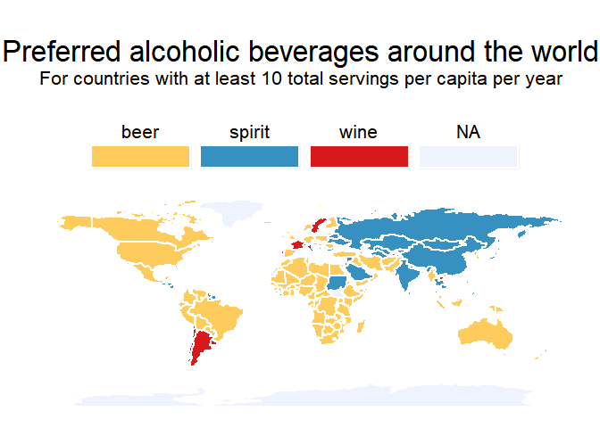
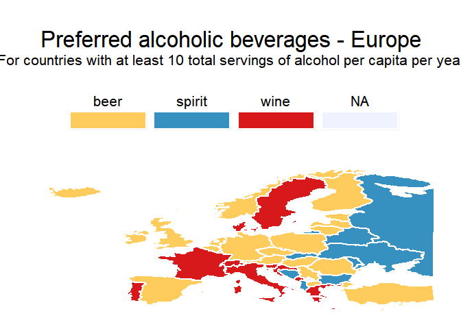
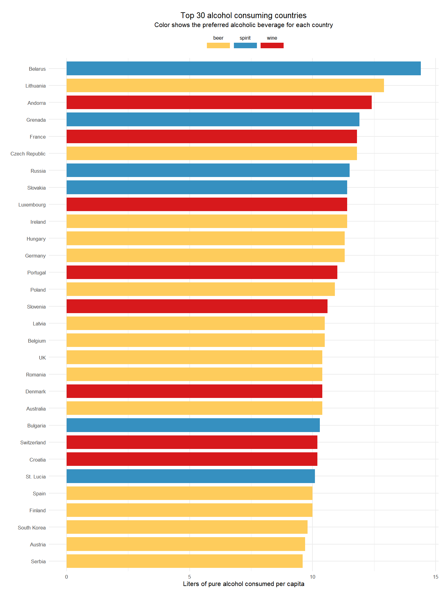

Alcohol Consumption
================
jakinpilla
Sun Apr 14 09:25:26 2019

Alcohol consumption around the
    world

``` r
library("tidyverse")
```

    ## -- Attaching packages ---------------------------------------------- tidyverse 1.2.1 --

    ## √ ggplot2 3.1.0     √ purrr   0.2.5
    ## √ tibble  1.4.2     √ dplyr   0.7.8
    ## √ tidyr   0.8.2     √ stringr 1.3.1
    ## √ readr   1.3.1     √ forcats 0.3.0

    ## -- Conflicts ------------------------------------------------- tidyverse_conflicts() --
    ## x dplyr::filter() masks stats::filter()
    ## x dplyr::lag()    masks stats::lag()

``` r
library("ggplot2")
library("reshape2")
```

    ## 
    ## Attaching package: 'reshape2'

    ## The following object is masked from 'package:tidyr':
    ## 
    ##     smiths

``` r
library("dplyr")
library("extrafont")
```

    ## Registering fonts with R

``` r
library("maps")
```

    ## Warning: package 'maps' was built under R version 3.5.3

    ## 
    ## Attaching package: 'maps'

    ## The following object is masked from 'package:purrr':
    ## 
    ##     map

Read data

``` r
alcohol = read_csv("data/drinks.csv")
```

    ## Parsed with column specification:
    ## cols(
    ##   country = col_character(),
    ##   beer_servings = col_double(),
    ##   spirit_servings = col_double(),
    ##   wine_servings = col_double(),
    ##   total_litres_of_pure_alcohol = col_double()
    ## )

``` r
alcohol$total_servings = alcohol$beer_servings + alcohol$wine_servings + alcohol$spirit_servings
alcohol %>%
  tbl_df() %>%
  mutate(total_servings = beer_servings + wine_servings + spirit_servings)
```

    ## # A tibble: 193 x 6
    ##    country beer_servings spirit_servings wine_servings total_litres_of~
    ##    <chr>           <dbl>           <dbl>         <dbl>            <dbl>
    ##  1 Afghan~             0               0             0              0  
    ##  2 Albania            89             132            54              4.9
    ##  3 Algeria            25               0            14              0.7
    ##  4 Andorra           245             138           312             12.4
    ##  5 Angola            217              57            45              5.9
    ##  6 Antigu~           102             128            45              4.9
    ##  7 Argent~           193              25           221              8.3
    ##  8 Armenia            21             179            11              3.8
    ##  9 Austra~           261              72           212             10.4
    ## 10 Austria           279              75           191              9.7
    ## # ... with 183 more rows, and 1 more variable: total_servings <dbl>

Calculate servings of each type relative to other types of alcohol

``` r
alcohol %>%
  mutate_at(vars(-country), funs(round(./total_servings, 2))) %>%
  mutate_all(funs(ifelse(is.nan(.), 0, .))) %>%
  select(-total_servings) %>%
  rename_at(vars(-country), ~ paste0("ratio_", .)) -> alcohol_ratio

alcohol %>%
  left_join(alcohol_ratio, by = "country") -> alcohol_combined

alcohol_combined  %>%
  select(country, contains("ratio_")) %>%
  gather(main_type, max, -country) %>%
  group_by(country) %>%
  slice(which.max(max)) %>%
  mutate(main_type = gsub("ratio_|_servings", "", main_type)) -> alcohol_main

alcohol_combined %>%
  left_join(alcohol_main, by = "country") -> alcohol_total
```

Sums over types

``` r
alcohol_total[, 2:4] %>% colSums()
```

    ##   beer_servings spirit_servings   wine_servings 
    ##           20489           15632            9544

Get world map

``` r
map.world <- map_data(map="world")
```

Which countries in data cannot be found in the list of map.world
countries?

``` r
countries = as.character(alcohol_total$country)[!is.na(alcohol_total$main_type)]
countries[!countries %in% map.world$region]
```

    ##  [1] "Antigua & Barbuda"            "Bosnia-Herzegovina"          
    ##  [3] "Cote d'Ivoire"                "Cabo Verde"                  
    ##  [5] "Congo"                        "DR Congo"                    
    ##  [7] "Russian Federation"           "St. Kitts & Nevis"           
    ##  [9] "St. Lucia"                    "St. Vincent & the Grenadines"
    ## [11] "Sao Tome & Principe"          "Trinidad & Tobago"           
    ## [13] "Tuvalu"                       "United Kingdom"

Alter names in data to match those in map.world

``` r
m = as.character(alcohol_total$country)
names(m) = m
m[c("Antigua & Barbuda", "Bosnia-Herzegovina", "Cote d'Ivoire", 
    "Cabo Verde", "Congo", "DR Congo", "Russian Federation", 
    "United Kingdom")] = c("Antigua", "Bosnia and Herzegovina", "Ivory Coast", 
                           "Cape Verde", "Republic of Congo", 
                           "Democratic Republic of the Congo", "Russia", "UK")

alcohol_total$country = unname(m)
```

Join alcohol data with map
data

``` r
map.world = left_join(map.world, alcohol_total, by = c('region' = 'country'))
map.world$main_type = factor(map.world$main_type)
```

Plot - World map with preferred alcoholic beverage per country

``` r
windowsFonts(arial=windowsFont("TT Arial"))
preferred_plot <- map.world %>% ggplot() +
  geom_polygon(aes(x = long, y = lat, group = group, fill = main_type), 
               color="white", size=1) +
  scale_fill_manual(values = c("#fecc5c", "#3690c0", "#d7191c"), na.value="#eff3ff") +
  labs(title="\nPreferred alcoholic beverages around the world", 
       subtitle="For countries with at least 10 total servings per capita per year\n") +
  guides(fill = guide_legend(keywidth = 6, keyheight = 1.5, title=NULL, label.position = "top", 
                             label.hjust = 0.5)) +
  theme(text=element_text(family="arial"),
        plot.title = element_text(hjust = 0.5, size=25), 
        plot.subtitle = element_text(hjust = 0.5, size = 16),
        legend.position = "top",
        legend.text=element_text(size=16),
        panel.background = element_blank(),
        plot.background = element_blank(),
        panel.grid = element_blank(),
        axis.text = element_blank(),
        axis.title = element_blank(),
        axis.ticks = element_blank()
        ) 

print(preferred_plot)  
```

<!-- -->

Select only European
countries

``` r
europe = c("Albania", "Finland", "Andorra", "Austria", "Belgium",  "Bulgaria", "Bosnia and Herzegovina", "Belarus", "Switzerland", "Czech Republic", "Cyprus", "Germany", "Denmark", "Canary Islands", "Spain", "Estonia", "France", "UK", "Greece", "Croatia", "Hungary", "Ireland", "Iceland", "Italy", "San Marino", "Kosovo", "Liechtenstein", "Lithuania", "Luxembourg", "Latvia", "Monaco", "Moldova", "Macedonia", "Malta", "Montenegro", "Netherlands", "Norway", "Poland", "Portugal", "Romania", "Russia", "Serbia", "Slovakia", "Slovenia", "Sweden",   "Turkey", "Ukraine", "Vatican")
map.europe = map.world[map.world$region %in% europe,]
```

Plot - Map of Europe with preferred alcoholic beverage per country

``` r
preferred_europe_plot <- map.europe %>%
  ggplot() +
  geom_polygon(aes(x = long, y = lat, group = group, fill = main_type), color="white", size=1) +
  xlim(c(-26,42)) +
  ylim(c(34,75)) +
  scale_fill_manual(values = c("#fecc5c", "#3690c0", "#d7191c"), na.value="#eff3ff") +
  labs(title="\nPreferred alcoholic beverages - Europe", 
       subtitle="For countries with at least 10 total servings of alcohol per capita per year\n") +
  guides(fill = guide_legend(keywidth = 6, keyheight = 1.5, title=NULL, 
                             label.position = "top", label.hjust = 0.5)) +
  theme(text=element_text(family="arial"),
        plot.title = element_text(hjust = 0.5, size=25), 
        plot.subtitle = element_text(hjust = 0.5, size = 16),
        legend.position = "top",
        legend.text=element_text(size=16),
        panel.background = element_blank(),
        plot.background = element_blank(),
        panel.grid = element_blank(),
        axis.text = element_blank(),
        axis.title = element_blank(),
        axis.ticks = element_blank()
  ) 


print(preferred_europe_plot)
```

<!-- -->

Select top 15 by liters of pure alcohol

``` r
alcohol_total %>% colnames()
```

    ##  [1] "country"                           
    ##  [2] "beer_servings"                     
    ##  [3] "spirit_servings"                   
    ##  [4] "wine_servings"                     
    ##  [5] "total_litres_of_pure_alcohol"      
    ##  [6] "total_servings"                    
    ##  [7] "ratio_beer_servings"               
    ##  [8] "ratio_spirit_servings"             
    ##  [9] "ratio_wine_servings"               
    ## [10] "ratio_total_litres_of_pure_alcohol"
    ## [11] "main_type"                         
    ## [12] "max"

``` r
top30 = alcohol_total[order(alcohol$total_litres_of_pure_alcohol, decreasing = T),][1:30,]

top30 %>%
  filter(country == "South Korea")
```

    ## # A tibble: 1 x 12
    ##   country beer_servings spirit_servings wine_servings total_litres_of~
    ##   <chr>           <dbl>           <dbl>         <dbl>            <dbl>
    ## 1 South ~           140              16             9              9.8
    ## # ... with 7 more variables: total_servings <dbl>,
    ## #   ratio_beer_servings <dbl>, ratio_spirit_servings <dbl>,
    ## #   ratio_wine_servings <dbl>, ratio_total_litres_of_pure_alcohol <dbl>,
    ## #   main_type <chr>, max <dbl>

``` r
top30 %>% View()

top30_plot <- top30 %>%
  ggplot() + 
  geom_bar(aes(x=reorder(country, total_litres_of_pure_alcohol, sum), 
               y=total_litres_of_pure_alcohol, fill=main_type), stat="identity", width=0.8) +
  coord_flip() +
  guides(fill = guide_legend(keywidth = 4, keyheight = 1, title=NULL, label.position = "top", 
                             label.hjust = 0.5)) +
  scale_fill_manual(values = c("#fecc5c", "#3690c0", "#d7191c"), na.value="#eff3ff") +
  labs(title="\nTop 30 alcohol consuming countries", 
       subtitle="Color shows the preferred alcoholic beverage for each country", 
       y="Liters of pure alcohol consumed per capita", x="") +
  theme_minimal(16) +
  theme(legend.position = "top",
        text=element_text(family="arial"),
        plot.title = element_text(hjust = 0.5),
        plot.subtitle = element_text(hjust = 0.5)
  )
```

``` r
print(top30_plot)
```

<!-- -->
